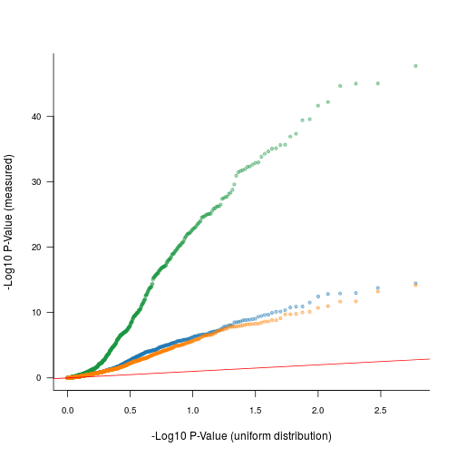

Create simulated data to show that a linear deconvolution of the expresison levels is not sufficient to figure out whether the eQTL arose from cancer or normal tissue component.
Set root directiory for this project.


```r
source("theRootDir.R")
```

Note, I'm creating a new operator to concatenate strings:


```r
'%&%' <- function(x, y)paste(x,y, sep= "")
```

Create actual simulated Expression datasets of 1,000 samples and 600 genes....


```r
cancerExpressionSimMat <- numeric(600*1000)
normalExpressionSimMat <- numeric(600*1000)
bulkExpressionSimMat <- numeric(600*1000)
normalEffectsIndependentOfCancer <- numeric(600*1000)
dim(cancerExpressionSimMat) <- c(600, 1000)
dim(normalExpressionSimMat) <- c(600, 1000)
dim(bulkExpressionSimMat) <- c(600, 1000)
dim(normalEffectsIndependentOfCancer) <- c(600, 1000)
numSamps <- 250

# I will use these as the simulated cell proportions, learned from TCGA data.
set.seed(12345) # Setting seed before running all of the below will ensure consistent result each time this is run

# Load the CPE tumor purity estimates for breast cancer.
nComsProps <- read.csv(paste(theRootDir, "ncomms9971-s2.csv", sep=""), as.is=T)
nComsProps_brca <- nComsProps[nComsProps[,2] == "BRCA" & substring(nComsProps[,1], 14, 16) == "01A", "CPE"] # exctract 01A (primary site) breast cancer samples.
nComsProps_brca_noNa <- nComsProps_brca[!is.na(nComsProps_brca)]

# Proportions that I will use in subsequent analysis
theProp <- sample(nComsProps_brca_noNa, 1000) # select 1000 samples at random (without replacement).
propInv <- (1-theProp)
```

Create 100 genes with a mixture of *different* eQTL in both Cancer and normal component. Increment effect sizes from -1 to +1.


```r
simulatedEffectSizesCancer <- seq(-.5, 0.49, .01) # Create 100 simulated effect sizes....
simulatedEffectSizesNormal <- sample(simulatedEffectSizesCancer) # randomeize the above
for(i in 1:100)
{
  # NOTE: rnorm() will add noise and mean of 0 and sd of 1, because the real data were standardized to a mean of 0 and sd of 1.
  cancerExpressionSimMat[i,] <- c(rep(1, numSamps) + rnorm(numSamps), rep(1 + simulatedEffectSizesCancer[i], (numSamps*2)) + rnorm(numSamps), rep(1 + (simulatedEffectSizesCancer[i]*2), numSamps) + rnorm(numSamps))
  normalExpressionSimMat[i,] <- c(rep(1, numSamps) + rnorm(numSamps), rep(1 + simulatedEffectSizesNormal[i], (numSamps*2)) + rnorm(numSamps), rep(1 + (simulatedEffectSizesNormal[i]*2), numSamps) + rnorm(numSamps))
  bulkExpressionSimMat[i, ] <- (cancerExpressionSimMat[i,] * theProp) + (normalExpressionSimMat[i,] * propInv) # Combine the above to create a bulk expression data, assuming gene expression is additive based on the proportions.
}
```

Create 100 genes with an eQTL in cancer only


```r
simulatedEffectSizesCancer[101:200] <- seq(-.5, 0.49, .01)
simulatedEffectSizesNormal[101:200] <- rep(0, 100) 
for(i in 101:200)
{
  cancerExpressionSimMat[i,] <- c(rep(1, numSamps) + rnorm(numSamps), rep(1 + simulatedEffectSizesCancer[i], (numSamps*2)) + rnorm(numSamps), rep(1 + (simulatedEffectSizesCancer[i]*2), numSamps) + rnorm(numSamps))
  normalExpressionSimMat[i,] <- c(rep(1, numSamps) + rnorm(numSamps), rep(1 + simulatedEffectSizesNormal[i], (numSamps*2)) + rnorm(numSamps), rep(1 + (simulatedEffectSizesNormal[i]*2), numSamps) + rnorm(numSamps))
  bulkExpressionSimMat[i, ] <- (cancerExpressionSimMat[i,] * theProp) + (normalExpressionSimMat[i,] * propInv) # Combine the above to create a bulk expression data, assuming gene expression is additive based on the proportions.
  normalEffectsIndependentOfCancer[i,] <- residuals(lm(normalExpressionSimMat[i,]~cancerExpressionSimMat[i,])) # This will be used later, to show the interaction model values arne't correlated with normal.
}
```

Create 100 genes with an eQTL in normal only


```r
simulatedEffectSizesCancer[201:300] <- rep(0, 100) 
simulatedEffectSizesNormal[201:300] <- seq(-.5, 0.49, .01) 
for(i in 201:300)
{
  cancerExpressionSimMat[i,] <- c(rep(1, numSamps) + rnorm(numSamps), rep(1 + simulatedEffectSizesCancer[i], (numSamps*2)) + rnorm(numSamps), rep(1 + (simulatedEffectSizesCancer[i]*2), numSamps) + rnorm(numSamps))
  normalExpressionSimMat[i,] <- c(rep(1, numSamps) + rnorm(numSamps), rep(1 + simulatedEffectSizesNormal[i], (numSamps*2)) + rnorm(numSamps), rep(1 + (simulatedEffectSizesNormal[i]*2), numSamps) + rnorm(numSamps))
  bulkExpressionSimMat[i, ] <- (cancerExpressionSimMat[i,] * theProp) + (normalExpressionSimMat[i,] * propInv) # Combine the above to create a bulk expression data, assuming gene expression is additive based on the proportions.
}
```

Create 100 genes with an eQTL in neither


```r
simulatedEffectSizesCancer[301:400] <- rep(0, 100) 
simulatedEffectSizesNormal[301:400] <- rep(0, 100) 
for(i in 301:400)
{
  cancerExpressionSimMat[i,] <- c(rep(1, numSamps) + rnorm(numSamps), rep(1 + simulatedEffectSizesCancer[i], (numSamps*2)) + rnorm(numSamps), rep(1 + (simulatedEffectSizesCancer[i]*2), numSamps) + rnorm(numSamps))
  normalExpressionSimMat[i,] <- c(rep(1, numSamps) + rnorm(numSamps), rep(1 + simulatedEffectSizesNormal[i], (numSamps*2)) + rnorm(numSamps), rep(1 + (simulatedEffectSizesNormal[i]*2), numSamps) + rnorm(numSamps))
  bulkExpressionSimMat[i, ] <- (cancerExpressionSimMat[i,] * theProp) + (normalExpressionSimMat[i,] * propInv) # Combine the above to create a bulk expression data, assuming gene expression is additive based on the proportions.
}
```

Create 100 genes with the SAME eQTL in Cancer and normal. 


```r
simulatedEffectSizesCancer[401:500] <- seq(-.5, 0.49, .01)
simulatedEffectSizesNormal[401:500] <- seq(-.5, 0.49, .01)
for(i in 401:500)
{
  cancerExpressionSimMat[i,] <- c(rep(1, numSamps) + rnorm(numSamps), rep(1 + simulatedEffectSizesCancer[i], (numSamps*2)) + rnorm(numSamps), rep(1 + (simulatedEffectSizesCancer[i]*2), numSamps) + rnorm(numSamps))
  normalExpressionSimMat[i,] <- c(rep(1, numSamps) + rnorm(numSamps), rep(1 + simulatedEffectSizesNormal[i], (numSamps*2)) + rnorm(numSamps), rep(1 + (simulatedEffectSizesNormal[i]*2), numSamps) + rnorm(numSamps))
  bulkExpressionSimMat[i, ] <- (cancerExpressionSimMat[i,] * theProp) + (normalExpressionSimMat[i,] * propInv) # Combine the above to create a bulk expression data, assuming gene expression is additive based on the proportions.
}
```

Create 100 genes with SIMILAR eQTL in Cancer and Normal. I.e. add some noise to the "cancer" eQTL effect size to create a "normal" effect size.


```r
simulatedEffectSizesCancer[501:600] <- seq(-.5, 0.49, .01)
a <- seq(-.5, 0.49, .01) + rnorm(100, 0, .1)
aScaled <- (a / max(a)) *.5 # Scale this so the effects won't be bigger than .5, to be consitent with everything else.
simulatedEffectSizesNormal[501:600] <- aScaled
for(i in 501:600)
{
  cancerExpressionSimMat[i,] <- c(rep(1, numSamps) + rnorm(numSamps), rep(1 + simulatedEffectSizesCancer[i], (numSamps*2)) + rnorm(numSamps), rep(1 + (simulatedEffectSizesCancer[i]*2), numSamps) + rnorm(numSamps))
  normalExpressionSimMat[i,] <- c(rep(1, numSamps) + rnorm(numSamps), rep(1 + simulatedEffectSizesNormal[i], (numSamps*2)) + rnorm(numSamps), rep(1 + (simulatedEffectSizesNormal[i]*2), numSamps) + rnorm(numSamps))
  bulkExpressionSimMat[i, ] <- (cancerExpressionSimMat[i,] * theProp) + (normalExpressionSimMat[i,] * propInv) # Combine the above to create a bulk expression data, assuming gene expression is additive based on the proportions.
}
```

Lets Now run an analysis and see how many "cancer" and "normal" eQTLs we can recover...


```r
genotype <- c(rep(0, numSamps), rep(1, (numSamps*2)), rep(2, numSamps)) # genotype is always the same
# genotype <- c(rep(1, numSamps), rep(2, (numSamps*2)), rep(3, numSamps)) # This produces the same results as above
# genotype <- c(rep(2, numSamps), rep(3, (numSamps*2)), rep(4, numSamps)) # However, this produces slightly different results....? Not sure if it can be argued that one makes more sense.? For now, lets stick to convention (encoding genotypes as 0,1,2)
cancerEffectInteractionModel <- numeric()
normalEffectInteractionModel <- numeric()
bulkEffectConventionalModel <- numeric()
pValuesBulkTumor <- numeric()
pValuesCancerInteractionModel <- numeric()
interactionTermPvalue <- numeric()
pValuesCancerInteractionModel_randomCpe <- numeric()
```

Create vector of the estimated proportions, but add measurement noise, to reflect the fact that these will not be estimated exactly in the real data.


```r
thePropNoisier <- theProp + rnorm(length(theProp), 0,0.1)
```

Quantile normalize the noise added proportions so they are on an identical distribution to the original proportions (but have noise added, i.e. they will be reordered to some extent).


```r
thePropSort <- sort(theProp)
thePropNoise <- thePropSort[rank(thePropNoisier)]
propInvNoise <- (1-thePropNoise)
```

Plot this correlation (supplementary figure)


```r
thisCor <- cor(thePropNoise, theProp) # this correlation is reasonable based on the correlations achieved by different genomics methods.
dir.create(theRootDir %&% "paper/figures/", recursive=T, showWarnings=F)
svg(file=paste(theRootDir, "paper/figures/suppFig1.svg", sep=""), width=4, height=4)
plot(theProp, thePropNoise, main=paste("Pearson Correlation = ", format(round(thisCor, 2), nsmall = 2)), las=1, cex.axis=.8, pch=20, col="#00000099", xlab="Simulated known proportion", ylab="Simulated measured (noise added) proportion", bty="l")
dev.off()
```

```
## pdf 
##   2
```

Recover the eQTLs using the different types of models (i.e. interaction (cancer) and conventional (bulk tumor)


```r
for(i in 1:nrow(bulkExpressionSimMat))
{
  cancerEffectInteractionModel[i] <- coef(summary(lm(bulkExpressionSimMat[i,]~genotype*propInvNoise)))[2, 1] # We use this inverse, as we want the main efffect "genotype" to correspond to 0% normal cells (which is 100% cancer.).
  normalEffectInteractionModel[i] <- coef(summary(lm(bulkExpressionSimMat[i,]~genotype*thePropNoise)))[2, 1]
  bulkEffectConventionalModel[i] <- coef(summary(lm(bulkExpressionSimMat[i,]~genotype)))[2, 1]
  pValuesBulkTumor[i] <- coef(summary(lm(bulkExpressionSimMat[i,]~genotype)))[2, 4]
  pValuesCancerInteractionModel[i] <- coef(summary(lm(bulkExpressionSimMat[i,]~genotype*propInvNoise)))[2, 4]
  pValuesCancerInteractionModel_randomCpe[i] <- coef(summary(lm(bulkExpressionSimMat[i,]~genotype*sample(propInvNoise))))[2, 4]
  interactionTermPvalue[i] <- coef(summary(lm(bulkExpressionSimMat[i,]~genotype*propInvNoise)))[4, 4]
}
fdrCancerInteraction <- p.adjust(pValuesCancerInteractionModel, method="BH")
fdrBulkTumor <- p.adjust(pValuesBulkTumor, method="BH")
fdrSigInCancerInteraction <- fdrCancerInteraction < 0.05
fdrSigInBulkTumor <- fdrBulkTumor < 0.05
sum(p.adjust(pValuesCancerInteractionModel_randomCpe, method="BH") < 0.05) # we get the fewest associations with a randomly arranged tumor purity estimate (same as what happens TCGA breast cancer).
```

```
## [1] 217
```

QQ-plot of the simulated P-values for bulk, cancer model and random CPE model.


```r
convSort <- sort(-log10(pValuesBulkTumor), decreasing=T)
intSort <- sort(-log10(pValuesCancerInteractionModel), decreasing=T)
intSortRand <- sort(-log10(pValuesCancerInteractionModel_randomCpe), decreasing=T)
```

Make a QQ plot


```r
plot(-log10(1:length(pValuesBulkTumor) / length(pValuesBulkTumor)), convSort, xlab="-Log10 P-Value (uniform distribution)", ylab="-Log10 P-Value (measured)", cex.axis=0.8, las=1, col="#1a964166", pch=20, bty="l")
points(-log10(1:length(pValuesCancerInteractionModel) / length(pValuesCancerInteractionModel)), intSort, pch=20, col="#1f78b466")
points(-log10(1:length(pValuesCancerInteractionModel_randomCpe) / length(pValuesCancerInteractionModel_randomCpe)), intSortRand, pch=20, col="#ff7f0066")
abline(0,1, col="red")
```



The interaction term itself is doing a poor job of picking out differential eQTLs. At least at only 1,000 samples. I.e. more samples are likely required for this to be useful.


```r
print(sum(p.adjust(interactionTermPvalue, method="BH") < 0.05))
```

```
## [1] 1
```

Calculate sensitivy and specificity for interaction term


```r
hasSigIntTerm <- which(p.adjust(interactionTermPvalue, method="BH") < 0.05)
isDifferentCancerNormal <- which(simulatedEffectSizesCancer != simulatedEffectSizesNormal)
sum(hasSigIntTerm %in% isDifferentCancerNormal) / length(isDifferentCancerNormal)
```

```
## [1] 0.002512563
```

Plot Figures 1a and 1b, which show how the bulk and interaction models performing.


```r
colsCanModel <- rep("#377eb8BB", 100)
colsBulkModel <- rep("#377eb8BB", 100)
colsCanModel[which(fdrCancerInteraction[201:300] < 0.05)] <- "#e41a1cBB"
colsBulkModel[which(fdrBulkTumor[201:300] < 0.05)] <- "#e41a1cBB"
dir.create(theRootDir %&% "paper/figures/figure1", recursive=T, showWarnings=F)
svg(file=paste(theRootDir, "paper/figures/figure1/Fig1a_scatter.svg", sep=""), width=3.5, height=3.5)
plot(simulatedEffectSizesNormal[201:300], bulkEffectConventionalModel[201:300], col=colsBulkModel, pch=20, bty="l", las=1, xlab="Simulated effect size normal", ylab="Conventional model Recovered effect size", cex.axis=0.8)
dev.off()
```

```
## pdf 
##   2
```

```r
svg(file=paste(theRootDir, "paper/figures/figure1/Fig1b_scatter.svg", sep=""), width=3.5, height=3.5)
plot(simulatedEffectSizesNormal[201:300], cancerEffectInteractionModel[201:300], col=colsCanModel, pch=20, bty="l", las=1, xlab="Simulated effect size normal", ylab="Interaction model Recovered effect size", cex.axis=0.8)
dev.off()
```

```
## pdf 
##   2
```

```r
print(cor.test(simulatedEffectSizesNormal[201:300], bulkEffectConventionalModel[201:300]))
```

```
## 
## 	Pearson's product-moment correlation
## 
## data:  simulatedEffectSizesNormal[201:300] and bulkEffectConventionalModel[201:300]
## t = 21.34, df = 98, p-value < 2.2e-16
## alternative hypothesis: true correlation is not equal to 0
## 95 percent confidence interval:
##  0.8648218 0.9366686
## sample estimates:
##      cor 
## 0.907146
```

```r
print(cor.test(simulatedEffectSizesNormal[201:300], cancerEffectInteractionModel[201:300]))
```

```
## 
## 	Pearson's product-moment correlation
## 
## data:  simulatedEffectSizesNormal[201:300] and cancerEffectInteractionModel[201:300]
## t = 1.0157, df = 98, p-value = 0.3123
## alternative hypothesis: true correlation is not equal to 0
## 95 percent confidence interval:
##  -0.0962836  0.2926167
## sample estimates:
##       cor 
## 0.1020648
```

Calculate Sensitivity across all data points (TP / P)
A function to calculate sensitivty, specificy and FDR from a vectors of estimated beta and p-values. Controlling for a specific FDR.
I would like this to also return the intex of the false positives, so I can deduced where they originated!


```r
calcSensitivitySpecificityFdr <- function(estimatedBetas, pValues, realBetas, fdr=0.05)
{
  # Sensitivty (true positive rate) = number of true positives / number of real positives. (TP/P)
  # Calculate the number of "positives", i.e. the number of effects really different from zero.
  positives <- which(realBetas != 0)
  numPositives <- sum(realBetas != 0)
  
  # Calculate the number of True Positives, i.e. the number of effects really different from zero that were identified by our model.
  correctDirectionality <- which((estimatedBetas * realBetas) > 0)
  isSignificant <- which(p.adjust(pValues, method="BH") < fdr)
  numTruePositives <- sum((isSignificant %in% correctDirectionality) & (isSignificant %in% positives)) # things significant with correct directionality.
  
  sensitivity <- numTruePositives/numPositives
  
  # Specificity (true negative rate) = the number of true negatives / number of real negatives.
  # the number of real negatives
  negatives <- which(realBetas == 0)
  numNegatives <- sum(realBetas == 0)
  notSignificant <- which(p.adjust(pValues, method="BH") > fdr)
  numTrueNegatives <- sum(notSignificant %in% negatives) # How many negatives were correctly assigned as "not significant"
  specificity <- numTrueNegatives/numNegatives
  
  # Calculate the type I error rate, i.e. the type I error rate....! I.e. the proportion of things called positive that are actually negative.
  MeasuredFalseDiscoveryRate <- sum(isSignificant %in% negatives) / length(isSignificant)
  FalseDiscoveriesIndex <- isSignificant[isSignificant %in% negatives]
  
  return(list(Sensitivty=sensitivity, Specificty=specificity, MeasuredFalseDiscoveryRate=MeasuredFalseDiscoveryRate, numSigEQtls=length(isSignificant), FalseDiscoveriesIndex=FalseDiscoveriesIndex))
}
```

Print the sensitivity and specificity for the cancer and bulk models.


```r
print(calcSensitivitySpecificityFdr(cancerEffectInteractionModel, pValuesCancerInteractionModel, simulatedEffectSizesCancer))
```

```
## $Sensitivty
## [1] 0.5833333
## 
## $Specificty
## [1] 0.9607843
## 
## $MeasuredFalseDiscoveryRate
## [1] 0.03333333
## 
## $numSigEQtls
## [1] 240
## 
## $FalseDiscoveriesIndex
## [1] 234 264 310 316 317 385 396 400
```

```r
print(calcSensitivitySpecificityFdr(bulkEffectConventionalModel, pValuesBulkTumor, simulatedEffectSizesCancer))
```

```
## $Sensitivty
## [1] 0.7954545
## 
## $Specificty
## [1] 0.8039216
## 
## $MeasuredFalseDiscoveryRate
## [1] 0.1117318
## 
## $numSigEQtls
## [1] 358
## 
## $FalseDiscoveriesIndex
##  [1]  51 201 202 204 205 206 207 209 211 212 214 217 220 222 225 226 231
## [18] 240 241 273 278 279 281 282 284 285 286 287 288 289 290 292 294 296
## [35] 297 298 299 300 339 400
```

What types of eQTL are driving the false positives?


```r
classesOfEqtlsInSimulation <- c("Different eQTLs", "Cancer Only eQTLs", "Normal Only eQTLs", "No eQTLs", "Same eQTL", "Similar eQTL")
bigClassesVec <- as.character(sapply(classesOfEqtlsInSimulation, rep, 100))
falsePositivesByType_tumor <- table(bigClassesVec[calcSensitivitySpecificityFdr(bulkEffectConventionalModel, pValuesBulkTumor, simulatedEffectSizesCancer)$FalseDiscoveriesIndex])
print(falsePositivesByType_tumor)
```

```
## 
##   Different eQTLs          No eQTLs Normal Only eQTLs 
##                 1                 2                37
```

```r
falsePositivesByType_cancer <- table(bigClassesVec[calcSensitivitySpecificityFdr(cancerEffectInteractionModel, pValuesCancerInteractionModel, simulatedEffectSizesCancer)$FalseDiscoveriesIndex])
print(falsePositivesByType_cancer)
```

```
## 
##          No eQTLs Normal Only eQTLs 
##                 6                 2
```

Create tables showing how sensitivety and specificity break down by type of eQTL.


```r
bulkSummaryList <- list()
cancerModelSummaryList <- list()
for(i in 0:5)
{
  lowNum <- 1 + (i*100)
  highNum <- ((i+1)*100)
  bulkSummaryList[[i+1]] <- calcSensitivitySpecificityFdr(bulkEffectConventionalModel[lowNum:highNum], pValuesBulkTumor[lowNum:highNum], simulatedEffectSizesCancer[lowNum:highNum])
  cancerModelSummaryList[[i+1]] <- calcSensitivitySpecificityFdr(cancerEffectInteractionModel[lowNum:highNum], pValuesCancerInteractionModel[lowNum:highNum], simulatedEffectSizesCancer[lowNum:highNum])
}
names(bulkSummaryList) <- classesOfEqtlsInSimulation
names(cancerModelSummaryList) <- classesOfEqtlsInSimulation
```

Supplementary Tables 1


```r
bulkSummarTable <- do.call(cbind, bulkSummaryList)
bulkSummarTable_withglobalInfo <- rbind(bulkSummarTable[-5,], rep(0, 6))
bulkSummarTable_withglobalInfo[5, names(falsePositivesByType_tumor)] <- falsePositivesByType_tumor
rownames(bulkSummarTable_withglobalInfo)[5] <- "Number of False Discoveries (globally)"
print(bulkSummarTable_withglobalInfo)
```

```
##                                        Different eQTLs Cancer Only eQTLs
## Sensitivty                             0.7676768       0.7979798        
## Specificty                             0               1                
## MeasuredFalseDiscoveryRate             0.01265823      0                
## numSigEQtls                            79              79               
## Number of False Discoveries (globally) 1               0                
##                                        Normal Only eQTLs No eQTLs
## Sensitivty                             NaN               NaN     
## Specificty                             0.65              1       
## MeasuredFalseDiscoveryRate             1                 NaN     
## numSigEQtls                            35                0       
## Number of False Discoveries (globally) 37                2       
##                                        Same eQTL Similar eQTL
## Sensitivty                             0.8383838 0.8080808   
## Specificty                             1         1           
## MeasuredFalseDiscoveryRate             0         0           
## numSigEQtls                            83        81          
## Number of False Discoveries (globally) 0         0
```

```r
write.csv(bulkSummarTable_withglobalInfo, file=paste(theRootDir, "paper/suppTab1.csv", sep=""))


# Supp Table 2
cancerModelSummaryTable <- do.call(cbind, cancerModelSummaryList)
cancerModelSummaryTable_withglobalInfo <- rbind(cancerModelSummaryTable[-5,], rep(0, 6))
cancerModelSummaryTable_withglobalInfo[5, names(falsePositivesByType_cancer)] <- falsePositivesByType_cancer
rownames(cancerModelSummaryTable_withglobalInfo)[5] <- "Number of False Discoveries (globally)"
print(cancerModelSummaryTable_withglobalInfo)
```

```
##                                        Different eQTLs Cancer Only eQTLs
## Sensitivty                             0.6363636       0.5656566        
## Specificty                             1               1                
## MeasuredFalseDiscoveryRate             0               0                
## numSigEQtls                            63              56               
## Number of False Discoveries (globally) 0               0                
##                                        Normal Only eQTLs No eQTLs
## Sensitivty                             NaN               NaN     
## Specificty                             1                 1       
## MeasuredFalseDiscoveryRate             NaN               NaN     
## numSigEQtls                            0                 0       
## Number of False Discoveries (globally) 2                 6       
##                                        Same eQTL Similar eQTL
## Sensitivty                             0.6060606 0.6161616   
## Specificty                             1         1           
## MeasuredFalseDiscoveryRate             0         0           
## numSigEQtls                            60        62          
## Number of False Discoveries (globally) 0         0
```

```r
write.csv(cancerModelSummaryTable_withglobalInfo, file=paste(theRootDir, "paper/SuppTab2.csv", sep=""))
```

Add another 500 "normal only" eQTLs.... How does this affect the FDR in the "bulk" and "cancer" models?


```r
set.seed(12345)
simulatedEffectSizesCancer[601:1100] <- rep(0, 100) 
simulatedEffectSizesNormal[601:1100] <- seq(-.5, 0.49, length.out=500)
for(i in 601:1100)
{
  cancerExpressionSimMat <- rbind(cancerExpressionSimMat, c(rep(1, numSamps) + rnorm(numSamps), rep(1 + simulatedEffectSizesCancer[i], (numSamps*2)) + rnorm(numSamps), rep(1 + (simulatedEffectSizesCancer[i]*2), numSamps) + rnorm(numSamps)))
  normalExpressionSimMat <- rbind(normalExpressionSimMat, c(rep(1, numSamps) + rnorm(numSamps), rep(1 + simulatedEffectSizesNormal[i], (numSamps*2)) + rnorm(numSamps), rep(1 + (simulatedEffectSizesNormal[i]*2), numSamps) + rnorm(numSamps)))
  bulkExpressionSimMat <- rbind(bulkExpressionSimMat, (cancerExpressionSimMat[i,] * theProp) + (normalExpressionSimMat[i,] * propInv)) # Combine the above to create a bulk expression data, assuming gene expression is additive based on the proportions.
#   print(i)
}

# Calculate principal comonents of this expression matrix are included as co-variates.
bulkPcs <- prcomp(t(bulkExpressionSimMat))$x
cor.test(propInvNoise, bulkPcs[,1], method="spearman")
```

```
## Warning in cor.test.default(propInvNoise, bulkPcs[, 1], method =
## "spearman"): Cannot compute exact p-value with ties
```

```
## 
## 	Spearman's rank correlation rho
## 
## data:  propInvNoise and bulkPcs[, 1]
## S = 178060000, p-value = 0.03072
## alternative hypothesis: true rho is not equal to 0
## sample estimates:
##         rho 
## -0.06833408
```

Re-run the eQTL analysis with the new normal specific eQTLs attached and compare the sensitivty, specificity, fdr, for the new dataset


```r
randomProp <- sample(propInvNoise)
randomPropP <- numeric()
randomPropEffect <- numeric()
onlyPropP <- numeric()
onlyPropEffect <- numeric()
pcsP <- numeric()
pcsPEffect <- numeric()
for(i in 1:nrow(bulkExpressionSimMat))
{
  cancerEffectInteractionModel[i] <- coef(summary(lm(bulkExpressionSimMat[i,]~genotype*propInvNoise)))[2, 1]
  normalEffectInteractionModel[i] <- coef(summary(lm(bulkExpressionSimMat[i,]~genotype*thePropNoise)))[2, 1]
  bulkEffectConventionalModel[i] <- coef(summary(lm(bulkExpressionSimMat[i,]~genotype)))[2, 1]
  pValuesBulkTumor[i] <- coef(summary(lm(bulkExpressionSimMat[i,]~genotype)))[2, 4]
  pValuesCancerInteractionModel[i] <- coef(summary(lm(bulkExpressionSimMat[i,]~genotype*propInvNoise)))[2, 4]
  interactionTermPvalue[i] <- coef(summary(lm(bulkExpressionSimMat[i,]~genotype*propInvNoise)))[4, 4]
  
  # How does the model perform when the proportion is simply shuffled randomly?
  randomPropP[i] <- coef(summary(lm(bulkExpressionSimMat[i,]~genotype*randomProp)))[2, 4]
  randomPropEffect[i] <- coef(summary(lm(bulkExpressionSimMat[i,]~genotype*randomProp)))[2, 1]
  
  # How does the model do when only proportion is included, no interaction term?
  onlyPropP[i] <- coef(summary(lm(bulkExpressionSimMat[i,]~genotype+propInvNoise)))[2, 4]
  onlyPropEffect[i] <- coef(summary(lm(bulkExpressionSimMat[i,]~genotype+propInvNoise)))[2, 1]
  
  # How does the model look if we include 5 principal componets (not sure this makes any sense in the context of these simulations)
  pcsP[i] <- coef(summary(lm(bulkExpressionSimMat[i,]~genotype+bulkPcs[,1:5])))[2, 4]
  pcsPEffect[i] <- coef(summary(lm(bulkExpressionSimMat[i,]~genotype+bulkPcs[,1:5])))[2, 1]
  
}
fdrBulkTumor <- p.adjust(pValuesBulkTumor, method="BH")
fdrSigInBulkTumor <- fdrBulkTumor < 0.05

print(calcSensitivitySpecificityFdr(cancerEffectInteractionModel, pValuesCancerInteractionModel, simulatedEffectSizesCancer))
```

```
## $Sensitivty
## [1] 0.5580808
## 
## $Specificty
## [1] 0.9900568
## 
## $MeasuredFalseDiscoveryRate
## [1] 0.03070175
## 
## $numSigEQtls
## [1] 228
## 
## $FalseDiscoveriesIndex
## [1] 264 317 396 673 797 879 968
```

```r
print(calcSensitivitySpecificityFdr(bulkEffectConventionalModel, pValuesBulkTumor, simulatedEffectSizesCancer))
```

```
## $Sensitivty
## [1] 0.7929293
## 
## $Specificty
## [1] 0.6164773
## 
## $MeasuredFalseDiscoveryRate
## [1] 0.4599659
## 
## $numSigEQtls
## [1] 587
## 
## $FalseDiscoveriesIndex
##   [1]   51  201  202  204  205  206  207  209  211  212  214  217  220  222
##  [15]  225  226  240  241  273  278  279  281  282  284  285  286  287  288
##  [29]  289  290  292  294  296  297  298  299  300  339  400  601  602  603
##  [43]  604  605  606  607  608  609  610  611  612  613  614  615  616  617
##  [57]  618  619  620  621  622  623  624  625  626  627  628  629  631  632
##  [71]  633  634  635  636  637  638  639  640  641  642  643  644  645  646
##  [85]  647  648  649  650  651  652  653  654  655  656  657  660  661  662
##  [99]  663  664  665  666  667  668  669  670  671  672  673  676  677  678
## [113]  681  682  683  684  685  686  688  689  690  691  693  694  695  696
## [127]  697  702  705  708  711  714  716  718  719  720  723  727  728  732
## [141]  737  738  740  742  744  751  755  761  762  768  772  773  782  785
## [155]  787  797  809  823  840  863  891  898  909  935  936  941  944  951
## [169]  953  954  957  958  959  963  964  967  968  970  971  972  974  975
## [183]  976  977  978  984  985  991  993  995  996  998 1000 1001 1002 1004
## [197] 1008 1010 1013 1014 1016 1018 1019 1020 1021 1022 1023 1024 1026 1027
## [211] 1030 1033 1035 1036 1037 1038 1039 1040 1041 1042 1045 1046 1048 1049
## [225] 1050 1051 1052 1053 1054 1056 1057 1058 1059 1060 1061 1062 1063 1064
## [239] 1065 1066 1067 1068 1069 1070 1071 1074 1076 1078 1079 1080 1081 1082
## [253] 1083 1084 1085 1086 1087 1088 1089 1090 1091 1092 1093 1094 1095 1096
## [267] 1097 1098 1099 1100
```

```r
print(calcSensitivitySpecificityFdr(randomPropEffect, randomPropP, simulatedEffectSizesCancer)) # FDR reaches about 22% with random "proportions"
```

```
## $Sensitivty
## [1] 0.5050505
## 
## $Specificty
## [1] 0.9360795
## 
## $MeasuredFalseDiscoveryRate
## [1] 0.1836735
## 
## $numSigEQtls
## [1] 245
## 
## $FalseDiscoveriesIndex
##  [1]  201  204  205  225  233  234  241  278  292  602  605  606  608  612
## [15]  643  644  645  653  656  684  702  716  724  742  772  799  964  995
## [29] 1014 1016 1027 1030 1033 1041 1042 1049 1051 1059 1067 1068 1080 1081
## [43] 1086 1090 1098
```

```r
print(calcSensitivitySpecificityFdr(onlyPropEffect, onlyPropP, simulatedEffectSizesCancer)) # This is interesting and definitely worth noting
```

```
## $Sensitivty
## [1] 0.7929293
## 
## $Specificty
## [1] 0.6193182
## 
## $MeasuredFalseDiscoveryRate
## [1] 0.4589041
## 
## $numSigEQtls
## [1] 584
## 
## $FalseDiscoveriesIndex
##   [1]  201  202  204  205  206  207  209  211  212  214  217  220  222  225
##  [15]  226  240  241  273  278  279  281  282  284  285  286  287  288  289
##  [29]  290  292  294  296  297  298  299  300  339  400  601  602  603  604
##  [43]  605  606  607  608  609  610  611  612  613  614  615  616  617  618
##  [57]  619  620  621  622  623  624  625  626  627  628  629  631  632  633
##  [71]  634  635  636  637  638  639  640  641  642  643  644  645  646  647
##  [85]  648  649  650  651  652  653  654  655  656  657  660  661  662  663
##  [99]  664  665  666  667  668  669  670  671  672  673  676  677  678  681
## [113]  682  683  684  685  686  688  689  690  691  693  694  695  696  697
## [127]  702  705  708  711  714  716  718  719  720  723  727  728  732  737
## [141]  738  740  742  744  751  755  761  762  768  772  773  782  785  787
## [155]  797  809  823  840  863  891  898  935  936  941  944  951  953  954
## [169]  957  958  959  963  964  967  968  970  971  972  974  975  976  977
## [183]  978  984  985  991  993  995  996  998 1000 1001 1002 1004 1008 1010
## [197] 1013 1014 1016 1018 1019 1020 1021 1022 1023 1024 1026 1027 1030 1033
## [211] 1035 1036 1037 1038 1039 1040 1041 1042 1045 1046 1048 1049 1050 1051
## [225] 1052 1053 1054 1056 1057 1058 1059 1060 1061 1062 1063 1064 1065 1066
## [239] 1067 1068 1069 1070 1071 1074 1076 1078 1079 1080 1081 1082 1083 1084
## [253] 1085 1086 1087 1088 1089 1090 1091 1092 1093 1094 1095 1096 1097 1098
## [267] 1099 1100
```

```r
print(calcSensitivitySpecificityFdr(pcsPEffect, pcsP, simulatedEffectSizesCancer))
```

```
## $Sensitivty
## [1] 0
## 
## $Specificty
## [1] 1
## 
## $MeasuredFalseDiscoveryRate
## [1] NaN
## 
## $numSigEQtls
## [1] 0
## 
## $FalseDiscoveriesIndex
## integer(0)
```

What class are the misattributed eQTLs


```r
bigClassesVec_withMore <- c(bigClassesVec, rep("Normal Only eQTLs", 500))
print(table(bigClassesVec_withMore[calcSensitivitySpecificityFdr(cancerEffectInteractionModel, pValuesCancerInteractionModel, simulatedEffectSizesCancer)$FalseDiscoveriesIndex]))
```

```
## 
##          No eQTLs Normal Only eQTLs 
##                 2                 5
```

```r
print(table(bigClassesVec_withMore[calcSensitivitySpecificityFdr(bulkEffectConventionalModel, pValuesBulkTumor, simulatedEffectSizesCancer)$FalseDiscoveriesIndex]))
```

```
## 
##   Different eQTLs          No eQTLs Normal Only eQTLs 
##                 1                 2               267
```

```r
print(table(bigClassesVec_withMore[calcSensitivitySpecificityFdr(onlyPropEffect, onlyPropP, simulatedEffectSizesCancer)$FalseDiscoveriesIndex]))
```

```
## 
##          No eQTLs Normal Only eQTLs 
##                 2               266
```

How does measuring the cell type proportions at varying levels of noise affect the performance of the model? Fig. 1(c)


```r
theNoiseLevels <- seq(0.01, 1.5, 0.025)
theNoiseLevels <- seq(0.01, 5, 0.1)
noiseCors <- numeric()
sensSpecOut <- list()
for(j in 1:length(theNoiseLevels))
{
  thePropNoiseForSims <- theProp + rnorm(length(theProp), 0, theNoiseLevels[j])
  thePropNoiseForSims <- thePropSort[rank(thePropNoiseForSims)]
  propInvNoiseForSims <- (1-thePropNoiseForSims)
  
  noiseCors[j] <- cor(thePropNoiseForSims, theProp)
  cancerEffectInteractionModel_simNoise <- numeric()
  pValuesCancerInteractionModel_simNoise <- numeric()
  for(i in 1:nrow(bulkExpressionSimMat))
  {
    cancerEffectInteractionModel_simNoise[i] <- coef(summary(lm(bulkExpressionSimMat[i,]~genotype*propInvNoiseForSims)))[2, 1]
    pValuesCancerInteractionModel_simNoise[i] <- coef(summary(lm(bulkExpressionSimMat[i,]~genotype*propInvNoiseForSims)))[2, 4]
  }
  sensSpecOut[[j]] <- calcSensitivitySpecificityFdr(cancerEffectInteractionModel_simNoise, pValuesCancerInteractionModel_simNoise, simulatedEffectSizesCancer)
#   print(j)
}
matplot <- do.call(cbind, sensSpecOut)
```

Plot the sensitivty, specificity and FDR as we increase the amount of noise with which the proportion of cancer cells are measured. Fig. 3(c).


```r
svg(file=paste(theRootDir, "paper/figures/figure1/Fig1c.svg", sep=""), height=3.5, width=7)
plot(noiseCors[order(noiseCors)], as.numeric(matplot[1,order(noiseCors)]), ylim=c(0,1), type="l", pch=1, col="#386cb0", ylab="Proportion", cex.axis=.8, xlab="Pearson correlation", bty="l", las=1)
lines(noiseCors[order(noiseCors)], as.numeric(matplot[2,order(noiseCors)]), type="l", pch=1, col="#4daf4a")
lines(noiseCors[order(noiseCors)], as.numeric(matplot[3,order(noiseCors)]), type="l", pch=1, col="#984ea3")
abline(h=0.05, col="red", lty=2)
legend("right", inset=.05, title="", c("Sensitivity","Specificity", "FDR"), col=c("#386cb0", "#4daf4a", "#984ea3"), fill=c("#386cb0", "#4daf4a", "#984ea3"), cex=.8, bty="n")
dev.off()
```

```
## pdf 
##   2
```

Add plots for a specifc example, i.e. a an eQTL is discovered because of infiltrating normal tissue, but is removed when we control for cancer cell proportion.


```r
theEqtl <- 298
svg(file=paste(theRootDir, "paper/figures/figure1/Fig1d.svg", sep=""), width=3, height=4)
plot((genotype+rnorm(length(genotype), 0, .1)), bulkExpressionSimMat[theEqtl,], col="#00000044", pch=20, las=1, ylab="Gene expression", xlab="Genotype", bty="l", xaxt = "n", cex.axis=.8) 
axis(1, at=0:2, labels=c("AA","AB","BB"), cex.axis=.8)
abline(coef=coef(summary(lm(bulkExpressionSimMat[theEqtl,]~genotype)))[,1], col="#e31a1c")
dev.off()
```

```
## pdf 
##   2
```

The P-value for this eQTL


```r
print(coef(summary(lm(bulkExpressionSimMat[theEqtl,]~genotype))))
```

```
##              Estimate Std. Error   t value     Pr(>|t|)
## (Intercept) 0.9831326 0.04617563 21.291155 3.171838e-83
## genotype    0.1517212 0.03770225  4.024195 6.149228e-05
```

Plot this eQTL when it is split into bins of the various cancer proportions (Fig. 1(e))


```r
names(propInvNoise) <- as.character(1:length(propInvNoise))
thisEqtl <- bulkExpressionSimMat[theEqtl,]
names(thisEqtl) <- as.character(1:length(propInvNoise))
names(genotype) <- as.character(1:length(propInvNoise))
d <- sort(propInvNoise)
a <- split(d, ceiling(seq_along(d)/200))
theBetas <- numeric()
theSes <- numeric()
for(i in 1:length(a))
{
  theCoefHere <- coef(summary(lm(thisEqtl[names(a[[i]])]~genotype[names(a[[i]])])))
  theSes[i] <- theCoefHere[2, 2]*1.96
  theBetas[i] <- theCoefHere[2, 1]
#   print(i)
}
seCancer <- coef(summary(lm(bulkExpressionSimMat[theEqtl,]~genotype*propInvNoise)))[2,2]*1.96
betaCancer <- coef(summary(lm(bulkExpressionSimMat[theEqtl,]~genotype*propInvNoise)))[2,1]
betaMaxCancer <- betaCancer + seCancer
betaMinCancer <- betaCancer - seCancer
maxY <- max(c(betaMaxCancer, theBetas+theSes)) + .1
minY <- min(c(betaMinCancer,theBetas-theSes)) - .1
x <- sapply(a, mean)
```

The P-value for the eQTL in cancer using the interaction model


```r
print(coef(summary(lm(bulkExpressionSimMat[theEqtl,]~genotype*propInvNoise))))
```

```
##                         Estimate Std. Error   t value     Pr(>|t|)
## (Intercept)           0.95068280 0.10427574 9.1170088 4.156870e-19
## genotype              0.01811759 0.08513356 0.2128137 8.315158e-01
## propInvNoise          0.13407630 0.34846856 0.3847587 7.004984e-01
## genotype:propInvNoise 0.47377057 0.27925637 1.6965435 9.009547e-02
```

Make the figure


```r
svg(file=paste(theRootDir, "paper/figures/figure1/Fig1e.svg", sep=""), width=5, height=4)
plot(x, theBetas, ylim=c(minY, maxY), xlim=c(-.28, 1.1), pch=20, xlab="Proportion of normal tissue", ylab="eQTL effect size", main="", las=1, cex.axis=.8, xaxt = "n", bty="l",panel.first=abline(h=0, col="darkgrey", lty=2))
axis(1, at=c(-.2, 0, .2, .4, .6, .8, 1), labels=c("Bulk\nTumor", "0%", "20%", "40%", "60%", "80%", "100%"), cex.axis=.8)
abline(v=-.1, col="black", lty=1, lwd=2)
arrows(x, theBetas-theSes, x, theBetas+theSes, length=0.05, angle=90, code=3)

# Plot the effect size and standard error for the bulk tumor
betaBulk <- coef(summary(lm(bulkExpressionSimMat[theEqtl,]~genotype)))[2,1]
seBulk <- coef(summary(lm(bulkExpressionSimMat[theEqtl,]~genotype)))[2,2]*1.96
points(-.2, coef(summary(lm(bulkExpressionSimMat[theEqtl,]~genotype)))[2,1], col="#1a9641", pch=20)
arrows(-.2, betaBulk-seBulk, -.2, betaBulk+seBulk, length=0.05, angle=90, code=3, col="#1a9641")

# add the points for "cancer" and "normal"
points(0, betaCancer, pch=20, col="#ca0020")

# add the standard errors for "cancer" and "normal"
arrows(0, betaMinCancer, 0, betaMaxCancer, length=0.05, angle=90, code=3, col="#ca0020") # cancer
dev.off()
```

```
## pdf 
##   2
```

```r
print(sessionInfo())
```

```
## R version 3.2.2 (2015-08-14)
## Platform: x86_64-pc-linux-gnu (64-bit)
## Running under: Ubuntu 14.04.3 LTS
## 
## locale:
##  [1] LC_CTYPE=en_US.UTF-8       LC_NUMERIC=C              
##  [3] LC_TIME=en_US.UTF-8        LC_COLLATE=en_US.UTF-8    
##  [5] LC_MONETARY=en_US.UTF-8    LC_MESSAGES=en_US.UTF-8   
##  [7] LC_PAPER=en_US.UTF-8       LC_NAME=C                 
##  [9] LC_ADDRESS=C               LC_TELEPHONE=C            
## [11] LC_MEASUREMENT=en_US.UTF-8 LC_IDENTIFICATION=C       
## 
## attached base packages:
## [1] stats     graphics  grDevices utils     datasets  methods   base     
## 
## other attached packages:
## [1] knitr_1.12.3
## 
## loaded via a namespace (and not attached):
## [1] magrittr_1.5   markdown_0.7.7 tools_3.2.2    stringi_1.0-1 
## [5] stringr_1.0.0  mime_0.4       evaluate_0.8.3
```

